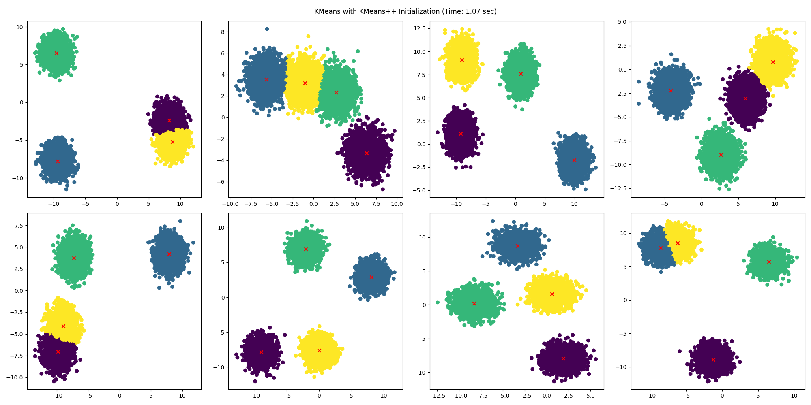
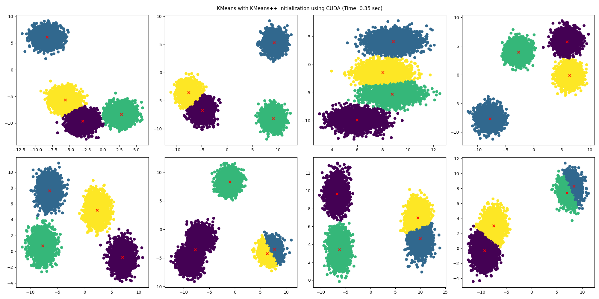

# KMeans and KMeans++ Clustering Algorithm for Batched Data

## using PyTorch backend

This repository contains the implementation of KMeans and KMeans++ clustering algorithms for batched data using PyTorch
backend.

By batched data, we mean KMeans problem needs to be solved per sample in the batch. Example with running time shown
below.

### Examples





Each batch index is independent of each other. This means that the KMeans problem can be solved in parallel
for each batch index. Since there were no existing implementation for this, we implemented it.

**Note**: The code is not optimized for speed. It is just a proof of concept and for prototyping in research. I am sure
this can be made much faster by using a CUDA kernel.

## Running Time

| Sample per Batch | Batches | CUDA  | Time (s) |
|------------------|---------|-------|----------|
| 10000            | 8       | False | 1.07     |
| 10000            | 8       | True  | 0.35     |
| 10000            | 128     | False | 6.50     |
| 10000            | 128     | True  | 3.52     |

## Simple Program Example

```python
from clustering import KMeansPP, KMeans

data = ...  # shape: (B, N, D) where B is the number of batches, N is the number of samples per batch, D is the dimension

# initialise using KMeans++
init_centers = KMeansPP(n_clusters=10, num_features=2)(data)

# KMeans
kmeans = KMeans(n_clusters=10, num_features=2, num_iterations=100)
centers, cluster_assignment = kmeans(data, init_centers)
```

## Requirements

- PyTorch
- Numpy
- einops
- matplotlib (for plotting)
